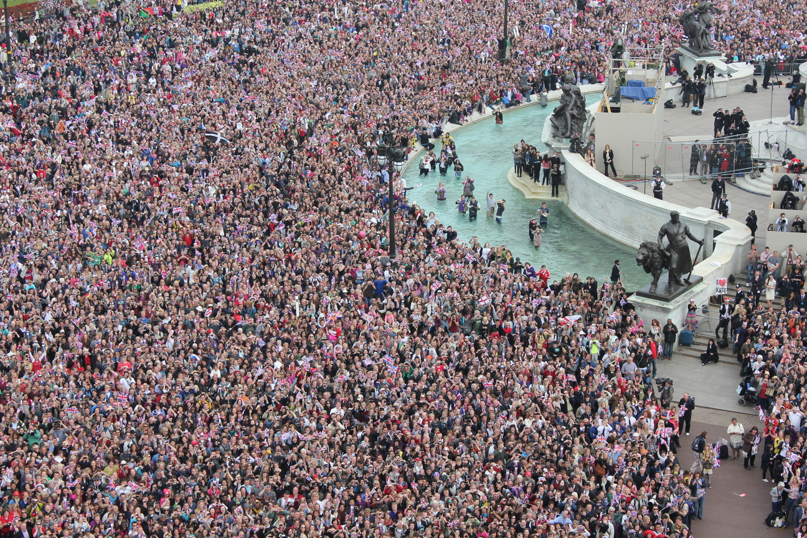
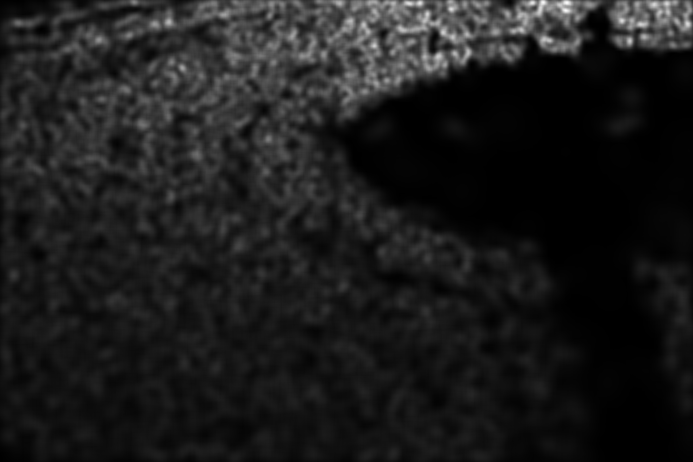

# Introduction to crowd analysis with deep learning

Crowd analysis is a research field in computer vision that has been getting renewed attention since the start of the 2011 deep learning hype.

There are important applications for analyzing large gatherings of people, like preventing tragic events such as the [2011 Love Parade disaster](https://en.wikipedia.org/wiki/Love_Parade_disaster).

[Another example](https://www.urbanite.net/de/dresden/artikel/ein-abend-mit-durchgezaehlt) comes from Germany, where a research group used crowd analysis to count the number of participants in right-wing demonstrations, discounting the inflated numbers given by the demonstrators.

#ucfqnrf crowd image

In this post, I want to give an overview over the challenges in crowd analysis and some of the tasks that can be learned with deep learning and point to some current research tackling them.

The data for crowd analysis can consist of either images (*single-image*) or videos (*multi-image*) taken from one position/camera (single-view) or multiple positions (multi-view).

For simplicity's sake, I will focus on the single-view, single-image case; keep in mind that in reality, one might be faced with many videos recorded from different positions with varying overlap.

*The crowd images for this post are taken from the [UCF-QNRF](https://www.crcv.ucf.edu/data/ucf-qnrf/) dataset which features up to ~12000 people in one image annotated with head positions.*

## Counting

*Crowd counting* is a simple task*:*

> Given an input image, predict the number of people in it

## Density estimation

The task here is to predict a *density map* of an input image, which means

> For every pixel in an input image, predict the crowd density at that pixel.

The crowd density in a pixel denotes how many people the pixel contributes to the total count in the image. It is a real number that is usually is *smaller than 1*, as people tend to take up more than one pixel in an image.

This is useful for understanding which part of the image has the most people 

Note that solving a density estimation also solves crowd counting: the sum of the densities at every pixel should add up to the total number of people in the image.

In practice, density estimation is often used as an auxiliary task for counting, since regressing the count directly proves hard.

## Localization

#image of crowd with annotations marked

> Given an input image, predict head positions for every person in it.

This is the hardest task of the three, in which you want to find (x, y)-coordinates centered around every person's head.

Note again that this solves both counting (just the number of coordinates) and density map estimation (density maps can be approximated from head annotations).

## Challenges

Solving these tasks brings some challenges that regular *object detection* algorithms like YOLO [4] are not equipped to handle:

The **number of people** in an image can vary wildly from under 10 to more than 10000. 

Most people in a crowd image are **heavily occluded**, meaning that only a small part of their body – the head – is visible.

Moreover, photographs of crowds suffer from **perspective distortion** causing people in the forergound to appear much larger than people in the background.

If you're interested in how these are being solved, here are some papers to get you started:

**[Single-Image Crowd Counting via Multi-Column Convolutional Neural Network](https://www.cv-foundation.org/openaccess/content_cvpr_2016/papers/Zhang_Single-Image_Crowd_Counting_CVPR_2016_paper.pdf)**

While this paper is no longer state-of-the-art, the model architecture is easy to understand.

**[Composition Loss for Counting, Density Map Estimation and Localization in Dense Crowds](https://www.crcv.ucf.edu/papers/eccv2018/2324.pdf)**

In this state-of-the-art paper, the authors build a single network architecture for tackling counting, density estimation *and* localization.

---

Thanks for reading and I hope you learned something new!
